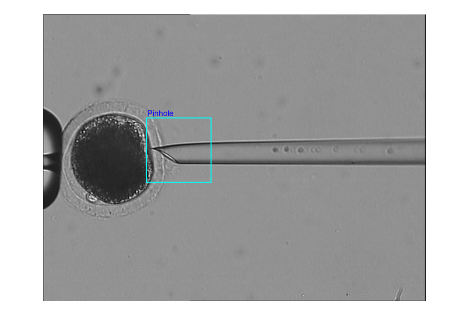
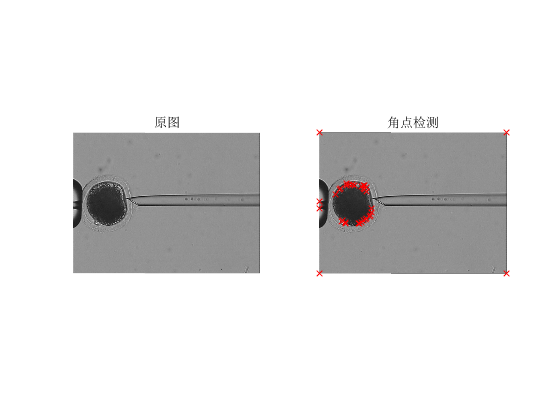

# Pinhole_recognition
# Terrain classification
***Author***: Shiwei Liu, [College of Artificial Intelligence, Nankai University](https://aien.nankai.edu.cn/)

***E-mail***: 2011832@mail.nankai.edu.cn

## About this program
This project is one of my assignments for the course "Computer Vision" during my junior year(2022) at Nankai University.It is used to train a terrain classification model in order to distinguish where the robot is running thus we can switch the controllling policy of it. This program is based on HOG features and SVM to train. It only demand a few seconds to train this simple SVM module and it also only need a dataset in small size (15 images of negative samples, 15 images of positive samples). But the accurancy of this module is not as good as CNN method, somtimes it couldn't recognize the right position of pinhole.

## Requirements
1. This project is a completely Matlab program whose all source codes are M files. You need to install the latest [Matlab](https://www.mathworks.com/products/matlab.html) at Windows platform.
2. Open ```Main.m``` in Matlab and click botton ```run```. If you wants to detect Harris corners, just run ```Harris.m```.

## Result
1. Run ```Main.m```, after a few seconds you will get the result:

    

2. Run ```Harris.m``` to get the detection result:

    
